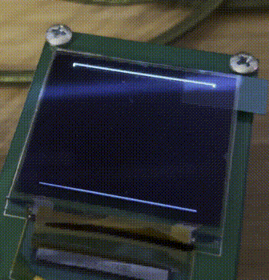

## STM32 FreeRTOS + libopencm3 + SCons template

This project might be useful for one looking to use start a project with FreeRTOS and LibopenCM3, but without make or vender IDE.

### Building 

#### Build libopencm3
```bash
cd libopencm3
make
```

#### Build app with rtos source

 - Scons
    ```console
    scons
    scons: Reading SConscript files ...
    scons: done reading SConscript files.
    scons: Building targets ...
    arm-none-eabi-gcc -o system.o -c -I./rtos -I. -Os -std=c99 -ggdb3 -mcpu=cortex-m4 -mthumb -mfloat-abi=hard  . . .   system.c
    
    arm-none-eabi-objcopy -O binary main.elf main.bin
    scons: done building targets.
    ```

  - Meson
    ```bash
    mkdir build
    meson setup build
    cd build && ninja
    ```

Make is still used to have libopenCM3 generate the appropriate linker script (generated.stm32f401re.ld), which only needs to be done once.


### Sparkfun OLED SSD1339 Driver 




NOTE: a major refactor is needed for the driver


Driver developed for an ancient SparkFun board, that for some reason i've held on to forever.

  - [SparkFun](https://www.sparkfun.com/products/retired/9676)
    - Note: I have the v1, which is a green board
  - [SparkFun Datasheet](http://www.sparkfun.com/datasheets/LCD/oled_carrier_datasheet.pdf)
  - [SSD1339 Datasheet](https://www.sparkfun.com/datasheets/LCD/SSD1339_1.pdf)


Driver and example works 99%, some rather odd behavior can be observed though. I plan to try again, using a raspberry pio and its Programmable IO. 

## Credits
 - [Project by Matthew Andrew, ARM7-clock](https://code.google.com/archive/p/arm7-oled-clock/downloads)
 - [IDLE Loop Code](https://idleloop.com/robotics/OLEDsample/)
 - [Driver Code by bdmihai](https://github.com/bdmihai/stm32f411ce-oled)   *** submodules ***
  - [SSD1306 Driver by Aleksander Alekseev](https://github.com/afiskon/stm32-ssd1306)

